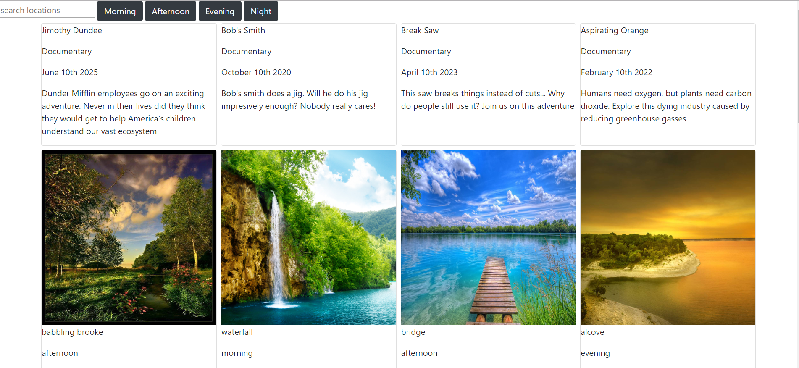

# Shotz

## Purpose

I attempt to dynamically load asynchronous data to the DOM using ajax syntax and modularly edit the dom with modules from Chrome. 

## To View

1. Clone repository to local machine.
1. Using http-server (`$ npm install http-server`) feed project to the port 8888 (`-p 8888`)
1. open localhost:8888 in your browser's address bar

## Notes
* Click on the movie to see a more focused view for the movie detail. You will also see the locations used for the movie.
* Filter the locations and movies by typing in the input box and pressing enter.
* Filter by Time of Day by clicking on the time of day buttons. You will be displayed all matching locations with the optimal time to film
* Styling is minimal due to simple project specifications
